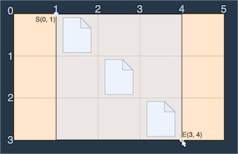
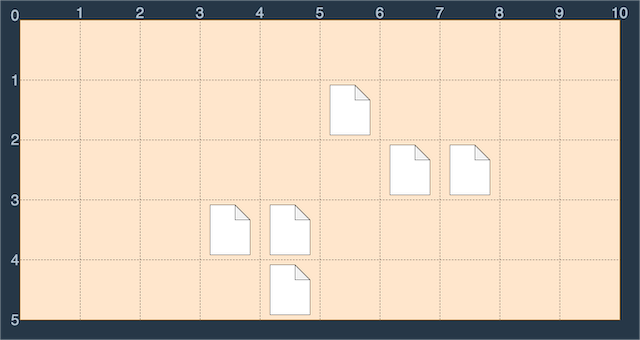

# 도전할 문제 **programmers 바탕화면**

## **programmers 바탕화면** (https://school.programmers.co.kr/learn/courses/30/lessons/161990) 도전

## 문제 - programmers 바탕화면

바탕화면에 있는 모든 파일(#)을 포함하는 가장 작은 직사각형의 좌상단과 우하단 좌표를 찾는 문제"
좀 더 자세하게 설명하자면:

- 2차원 배열로 표현된 바탕화면에서 '#' 문자는 파일을 의미함
- 모든 파일을 한 번에 드래그하여 선택할 수 있는 가장 작은 직사각형의 크기를 구해야 함
- 직사각형은 좌상단(lux, luy)과 우하단(rdx, rdy) 좌표로 표현됨
- 반환값은 [lux, luy, rdx, rdy] 형태의 정수 배열

입출력 예
| Wallpaper | result |
| :-------- | ----------: |
| [".#...", "..#..", "...#."]| [0, 1, 3, 4] |
| ["..........", ".....#....", "......##..", "...##.....", "....#....."]| [1, 3, 5, 8] |
| [".##...##.", "#..#.#..#", "#...#...#", ".#.....#.", "..#...#..", "...#.#...", "....#...."]| [0, 0, 7, 9] |
| ["..", "#."]| [1, 0, 2, 1] |

## 접근 방식

### 첫 번째 도전(programmers-바탕화면.cpp, programmers-바탕화면.py)

1. 아래 두 이미지를 분석해보자
   
   예시 1:
   입력: (0,1), (1,2), (2,3)
   출력: (0,1), (3,4)


예시 2:
입력: (1,5), (2,6), (2,7), (3,3), (3,4), (4,4)
출력: (1,3), (5,8)

예제 입출력 분석 결과:

1.  문제 요구 사항은 두개의 점 위치를 요구하며, 입력한 모든 점이 다 포함되는 최소한의 범위로 말해야 한다
2.  (x,y) 각각이 최소인것과 최댄인것 각각을 먼저구한다.
3.  단, 2단계에서 구한 (x,y)의 최댓값은 x, y각각에 +1을 해야 한다.
    => 왜냐하면 결국 파일은 예를 들면 (0,0), (0,1), (1,0), (1,1) 사이에 들어있을건데 우리가 구한 점들은 (0,0)위치에 해당하는 값을 찾아냈기때문이다.
    => 최솟값은 (0,0)위치를 찾아내는게 맞지만 최댓값은 (1,1)위치를 찾아내야 하기에 x, y좌표에 각각 +1을 해야 했다.

## 배운 점

1. **c++에서 pair 사용법**

   x, y 값 동시에 같이 계산해야 하는 상황이기에 pair를 사용해야 했다.
   pair는 `algorithm` 라이브러리를 호출해야 사용할 수 있다.

   ```
   ex)
      vector <pair<int, int>> vec;

   ex)
      vec.push_back({1,2});
   ```

2. **Iterable 및 문자열에서 size(), length() 혼동** **(매번 헷갈려서 정리함)**

   `C++`
   vector의 크기를 구할때, size()를 사용하는거고 문자열 길이를 구할때, length()를 사용하자.

   ```
   ex)
      vector <int> vec(10,0);
      cout << vec.size();

   ex)
      #include <sstream>
      string source = "Happy Coding";
      cout << source.length();
   ```

   `Python3`
   python3에서 리스트의 크기 및 문자열 길이 구할 때는 항상 len() 사용한다.

   ```
   ex)
      # 문자열 길이
      text = "Hello World"
      length = len(text)  # 11

   ex)
      # 리스트 길이
      my_list = [1, 2, 3, 4, 5]
      count = len(my_list)  # 5

   ex)
      # 딕셔너리 길이
      my_dict = {"a": 1, "b": 2, "c": 3}
      dict_size = len(my_dict)  # 3
   ```
